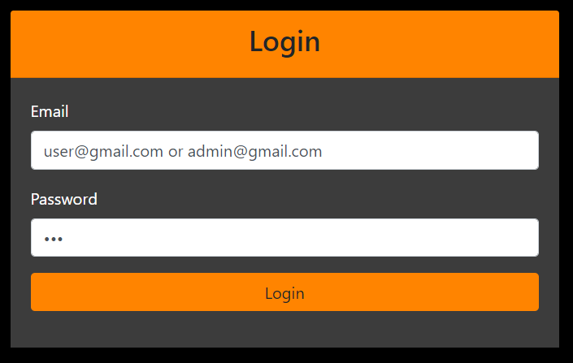
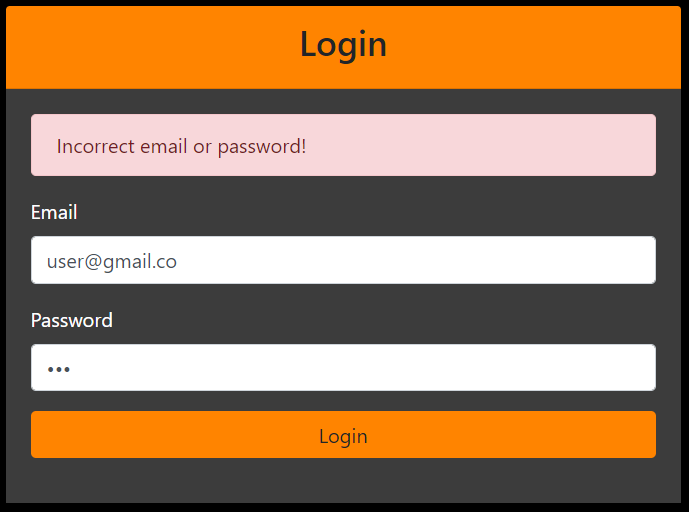
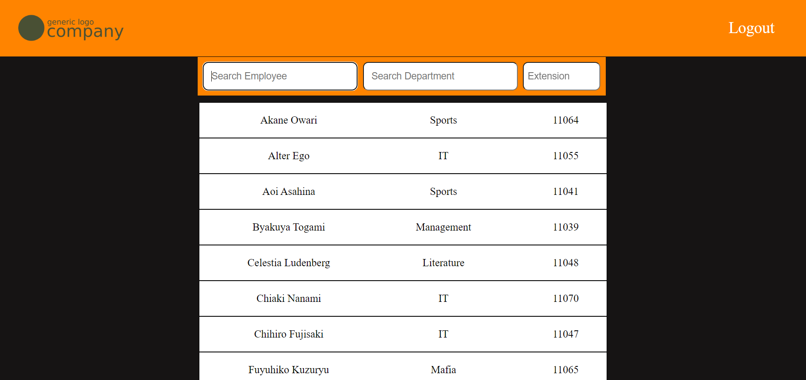
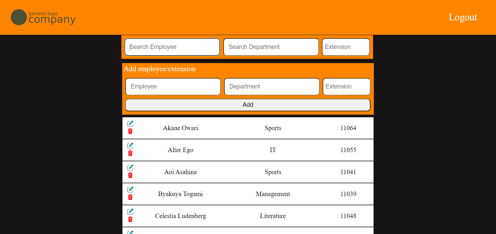

# extension_manager
This project was undertaken to fulfill a client's need. I was asked to create a system where all the employees of that branch could search for each other's extension numbers. Additionally, the system should allow an administrator to perform CRUD operations: Create, Read, Update, and Delete. Other users should have permission to read only.

These requirements were fulfilled by creating a website with a login system and proper security validations. Once logged in, the system generates a web page containing the extension numbers presented inside the database and allows users to perform actions they have permission for, including searches through Javascript's Regex.

## Technologies Used
- MySQL
- PHP
- Javascript
- Bootstrap
- CSS
- HTML

## Features
- Responsiveness
- Secure login system
- Database connectivity via environment variables
- SSL for enhanced security
- Dynamic content generation according to user's permission
- Instant search using Regex
- CRUD operations for administrators

## Screenshots

  
  
   
  
  
  

